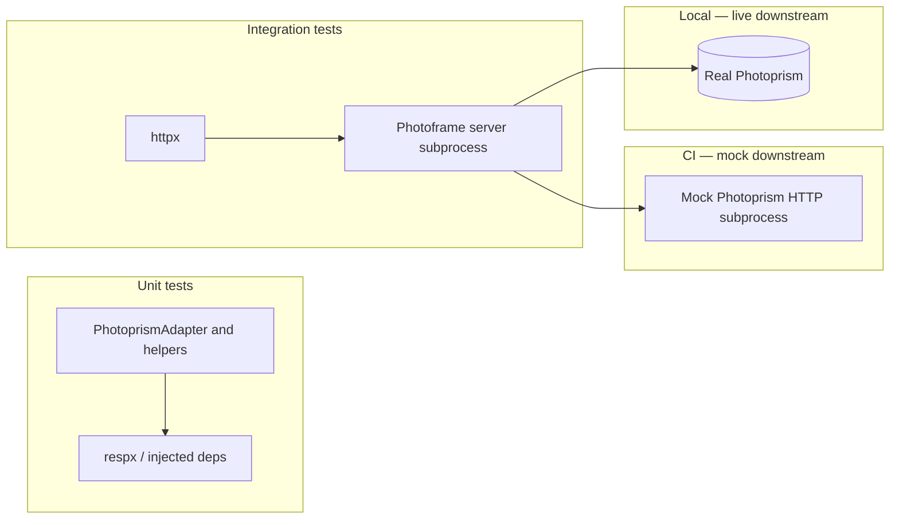

# WhPhotoframe testing plan

CI runs pytest in the **`server-test`** workflow job on every PR and push to `main`.

Two kinds of tests. Integration tests always go through the **Photoframe REST API** on a **running server** — never call Photoprism directly from pytest.




---

## Directory layout

```
server/tests/
├── conftest.py              # Session fixture: load photoprism_photos_export JSON
├── fixtures/
│   └── photoprism_photos_v0_response.json
├── support/                 # Shared helpers (import path: support.* with pythonpath=tests)
│   ├── api_client.py        # PhotoframeApiClient (httpx wrapper)
│   ├── mock_photoprism_server.py
│   ├── photoframe_stack.py  # Starts uvicorn + mock Photoprism for integration mock mode
│   └── photoprism.py        # Pagination helpers + respx side effects
├── unit/
│   ├── test_photo_source_factory.py
│   └── test_photoprism_adapter.py
└── integration/
    ├── conftest.py          # Session Photoframe URL + photoframe_api fixture
    └── test_photos_api.py
```

---

## 1. Unit tests (`tests/unit/`)

**Purpose:** Test a specific class or function in isolation. Dependencies are mocked and/or injected. Fast, no Photoframe server.

**Primary target:** `PhotoprismAdapter` and helpers (`_photo_from_record`, `_parse_pagination_headers`, `_list_photos_params`).

**How:** Call the unit under test directly. Mock Photoprism with **respx** and JSON fixtures under `tests/fixtures/`.


| What to test              | Example                                            |
| ------------------------- | -------------------------------------------------- |
| Record → `Photo` mapping  | Valid row, missing `UID` / `TakenAt` / `Path`      |
| Pagination header parsing | Invalid ints, negative values, `X-Count > X-Limit` |
| List request params       | `count`, `offset`, `primary=true`                  |
| `list_photos()` behavior  | Multi-page loop via respx + full obfuscated export |


**Fixtures:** `photoprism_photos_v0_response.json` (obfuscated). Add smaller fixtures later for edge cases.

**Run:**

```bash
cd server
pytest tests/unit/
```

---

## 2. Integration tests (`tests/integration/`)

**Purpose:** End-to-end HTTP to Photoframe (`/api/v0/photos`, …). Tests never open TCP to Photoprism.

### 2a. Mock downstream (default, CI)

**Behavior:** Pytest starts **two subprocesses**: (1) Starlette mock serving `GET /api/v1/photos` from the obfuscated fixture with pagination headers; (2) **uvicorn** running `app.main:app` with `PHOTOPRISM_BASE_URL` pointing at (1). Tests use **httpx** against (2).

### 2b. Live downstream (local only)

**Behavior:** Set `PHOTOFRAME_LIVE_TEST=1`. Tests call **your** Photoframe URL (`PHOTOFRAME_BASE_URL`, default from `config/ports.json`). You must start the server yourself (e.g. `docker compose up`). Downstream Photoprism uses real `.env`.

**CI:** Do not set `PHOTOFRAME_LIVE_TEST`.

**Run:**

```bash
cd server
pytest tests/integration/

docker compose up   # then:
PHOTOFRAME_LIVE_TEST=1 pytest tests/integration/ -v -s
```

---

## Comparison


|                       | Unit         | Integration (mock)           | Integration (live) |
| --------------------- | ------------ | ---------------------------- | ------------------ |
| **Photoframe server** | No           | Yes (pytest-spawned uvicorn) | Yes (you run it)   |
| **Client**            | Direct calls | httpx → Photoframe           | httpx → Photoframe |
| **Photoprism**        | respx        | Mock HTTP subprocess         | Real instance      |
| **CI**                | Yes          | Yes                          | No                 |


---

## Commands (quick reference)

```bash
cd server
pip install -e ".[dev]"

pytest tests/unit/                         # unit only
pytest tests/integration/                  # integration mock stack
PHOTOFRAME_LIVE_TEST=1 pytest tests/integration/ -v -s

pytest                                     # everything (default suite)
```

---

## TODO

**Unit**

- Smaller JSON fixtures (empty catalog, one page, auth failure body).

**Integration**

- Optional: reuse Docker Compose stack instead of subprocess uvicorn for mock mode (same HTTP surface).

